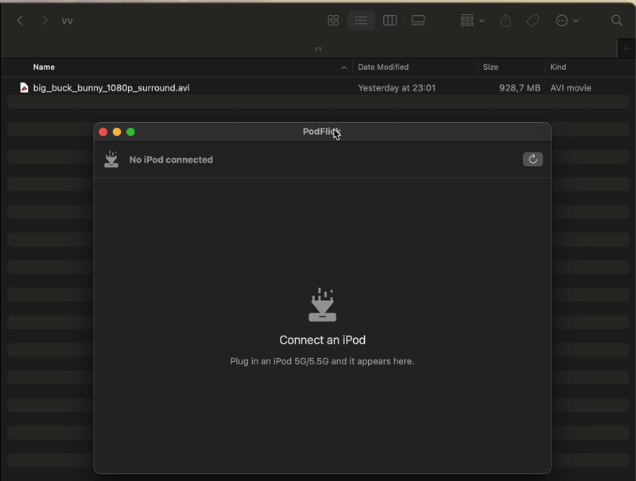
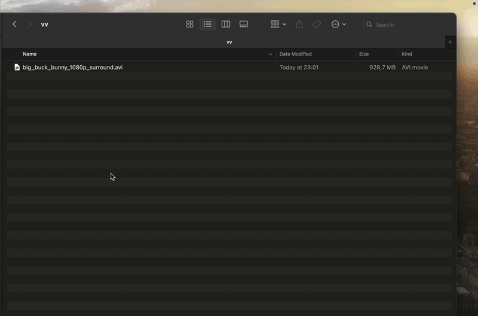
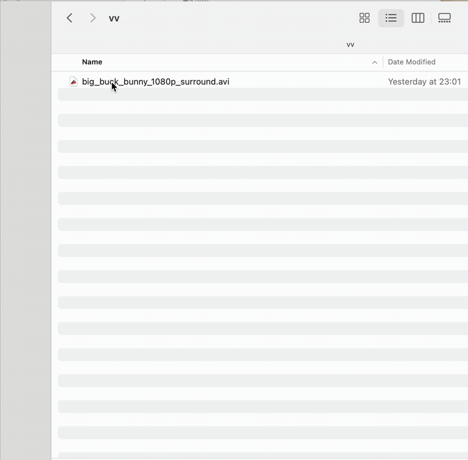

# PodFlick

[](https://github.com/rockerlabs/podflick/actions/workflows/ci.yml)
[](LICENSE)

Drag & drop videos onto your classic iPod (5G/5.5G) — no iTunes.

PodFlick converts any video to the iPod Video spec (H.264 baseline
≤640×480 ≤1.5 Mbps + AAC) via ffmpeg and writes it directly into the
device's `iTunesDB`, using surgical in-place edits proven against real
hardware. Works with both Mac-formatted (HFS+) and Windows-formatted
(FAT32, incl. Rockbox dual-boot) iPods.

## Demo



Plug in the iPod, drop a video anywhere in the window, eject — done.
(Conversion sped up; a real transfer of this 10-minute clip takes under a minute.)

## Install

**[⬇ Download PodFlick.dmg](https://github.com/rockerlabs/podflick/releases/latest/download/PodFlick.dmg)**
(always the latest) — open it and drag **PodFlick** into **Applications**.
That's the whole install: the app is signed and **notarized** (it opens with no
"unidentified developer" warning) and **ffmpeg is bundled**, so no `brew
install` is needed.

Requirements: **Apple Silicon (arm64), macOS 14+**, and an iPod Video 5G/5.5G
mounted as a disk. (Moving the app into `/Applications` also registers the
Finder **Transfer to iPod** service — see below.)

A specific version or a plain `.zip` is on the [releases page](https://github.com/rockerlabs/podflick/releases).

## Compatibility

### iPods

| Device | Firmware | Disk format | Status |
| --- | --- | --- | --- |
| iPod Video 5G (2005, 30/60 GB) | stock Apple 1.3 | HFS+ or FAT32 | ✅ Supported, proven on real hardware |
| iPod Video 5.5G (2006, 30/80 GB) | stock Apple 1.3 | HFS+ or FAT32 | ✅ Supported, proven on real hardware |
| iPod Video 5G/5.5G | Rockbox 4.0 dual-boot (Apple 1.3) | FAT32 | ✅ Supported — boot the Apple firmware to watch (see [Known issues](#known-issues--limitations)) |
| iPod Classic (6G and later) | stock Apple | — | 🔜 Planned — hash-protected `iTunesDB` (see [Roadmap](#roadmap)) |
| Nano / Shuffle / Touch, iPhone, iPad | — | — | ❌ Not planned |

The iPod must mount as a disk (Enable Disk Use / disk mode); transferred
videos play in the **stock Apple firmware**.

### Computers

| Platform | Status |
| --- | --- |
| Apple Silicon Mac, macOS 14+ | ✅ Supported (verified up to macOS 26 Tahoe) |
| Intel Mac | ❌ Not supported |
| Windows / Linux | ❌ Not planned |

## Status

**PodFlick 1.0 is released** — see the [changelog](CHANGELOG.md). The iTunesDB
engine is proven end-to-end on real hardware; the Python reference
implementation + golden fixtures are in [`reference/`](reference/) and the
format spec is in [docs/itunesdb-format.md](docs/itunesdb-format.md).

## Build from source

For contributors, or a dev build. A source build shells out to an `ffmpeg` on
your `PATH` (rather than the bundled one); producing a self-contained,
notarized release is documented in
[docs/bundling-ffmpeg.md](docs/bundling-ffmpeg.md).

```
brew install xcodegen ffmpeg
cp Signing.xcconfig.template Signing.local.xcconfig   # set DEVELOPMENT_TEAM
xcodegen generate
xcodebuild -project PodFlick.xcodeproj -scheme PodFlick build
```

Build requirements: macOS 14+, Xcode 15+, `ffmpeg` on `PATH`.

## Background transfer (Finder service + URL scheme)

Besides the main window, PodFlick can take a video without you opening the
app first:

- **Finder** — right-click a video → **Services → Transfer to iPod**.
- **Shortcuts / Automator** — open a `podflick://transfer?path=/abs/clip.mp4`
  URL (repeat `&path=` for several files).

Either way the app converts and writes in the background: no window, just a
menu-bar item showing progress and an **Eject** action, plus a completion
notification.



> **The Finder "Transfer to iPod" item only appears when `PodFlick.app` lives
> in `/Applications`.** Running a copy straight from the build folder works when
> invoked directly (e.g. via `NSPerformService`), but Finder won't surface the
> Services menu item for it. After the first copy into `/Applications`, launch
> the app once (and, if needed, `/System/Library/CoreServices/pbs -flush`) so
> macOS registers the service.
>
> **On macOS 26 (Tahoe) you must also enable the service once.** Even when it's
> registered, macOS ships the toggle **off**, so the menu item stays hidden until
> you tick it: **System Settings → Keyboard → Keyboard Shortcuts… → Services →
> Files and Folders → Transfer to iPod**. (No toggle needed for the
> `podflick://` URL scheme.)



Full hardware smoke steps: [docs/smoke-service-transfer.md](docs/smoke-service-transfer.md).

## Known issues & limitations

These are device- and platform-level behaviors PodFlick can't change, plus a
couple of troubleshooting notes. None of them are bugs in the transfer itself.

- **A brand-new video can play black on its first open.** A just-transferred clip
  may show a black screen on its *very first* launch — no response to buttons for
  ~10–15 s, then it drops back to the menu. Play it a second time and it works
  normally (both 320×240 and 640×480). This is a pre-existing iPod firmware quirk
  (first-open indexing/thumbnailing) seen on both 5G and 5.5G — it happens with
  videos made by other tools too, not just PodFlick.

- **Model / Firmware / Serial can show blank in the app.** iPods that have been
  restored or set up for Rockbox often have an empty (0-byte) `Device/SysInfo`,
  so those header fields stay blank. Format and capacity still display. This
  reflects the device, not a PodFlick problem.

- **Play PodFlick's videos from the stock Apple firmware.** Clips are encoded for
  the classic firmware's hardware decoder. On a Rockbox dual-boot iPod, browsing
  and music work under Rockbox, but boot into the original Apple firmware to watch
  the transferred video.

- **If the iPod keeps mounting and unmounting (flapping),** try a different USB
  cable before anything else. A device that mounts for a second, disconnects, and
  repeats is almost always a bad cable or contact, not PodFlick.

- **No Finder "Transfer to iPod" item?** It only appears once `PodFlick.app` lives
  in `/Applications` — see [Background transfer](#background-transfer-finder-service--url-scheme).

## Roadmap

Planned, in no particular order and with no dates — subject to change:

- **Manual playlists** — create playlists on the iPod from the app (the
  database engine already supports it; the UI is next).
- **Music support** — sync audio, not just video.
- **iPod Classic (6G and later)** — support the hash-protected `iTunesDB` of
  the later Classics.
- **Device backup & restore** — one-click copy of the iPod's media + database
  to the Mac and back, as a safety net for aging hardware.
- **Localization** — externalize the UI strings; Russian first.
- **Smoother Finder-service setup** — surface the macOS 26 Services toggle
  from the app instead of the manual System Settings trip.

Found a bug or want something else? [Open an issue](https://github.com/rockerlabs/podflick/issues).

## License

PodFlick's own code is released under the [MIT License](LICENSE).

**ffmpeg.** PodFlick shells out to `ffmpeg`/`ffprobe` as separate child
processes — it never links them in, so its own source stays MIT either way:

- **Source checkouts / Homebrew dev builds** do not bundle ffmpeg; they use an
  ffmpeg you install yourself (`brew install ffmpeg`), whose license stays with
  your copy.
- **Notarized release builds** bundle an **LGPL v2.1** ffmpeg/ffprobe (built
  with no GPL or non-free components). The compliance package — license text,
  the exact source revision, the build/configure line, and a written offer for
  the corresponding source — is in [`licenses/ffmpeg/`](licenses/ffmpeg/).

The iTunesDB read/write layer is an independent, byte-level reverse engineering
of the on-device format (see [docs/itunesdb-format.md](docs/itunesdb-format.md));
no third-party database library is used or derived from.

### Trademarks

"iPod" and "iTunes" are trademarks of Apple Inc. PodFlick refers to them only
to describe the hardware it works with (nominative use) and ships none of
Apple's artwork or icons. PodFlick is an independent, open-source project — not
affiliated with, endorsed by, or sponsored by Apple Inc. The same notice
appears in the app's About panel.
